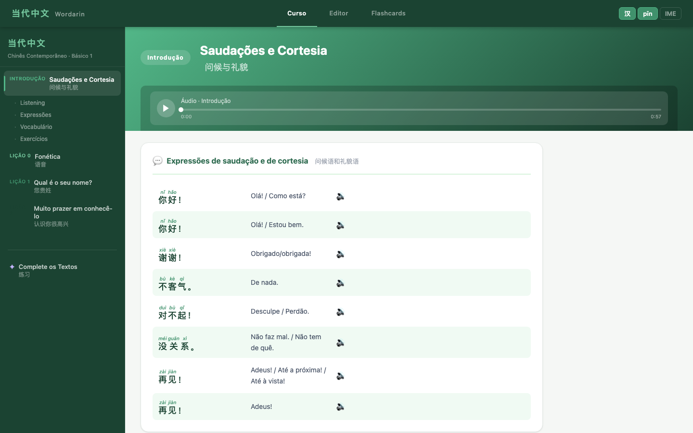
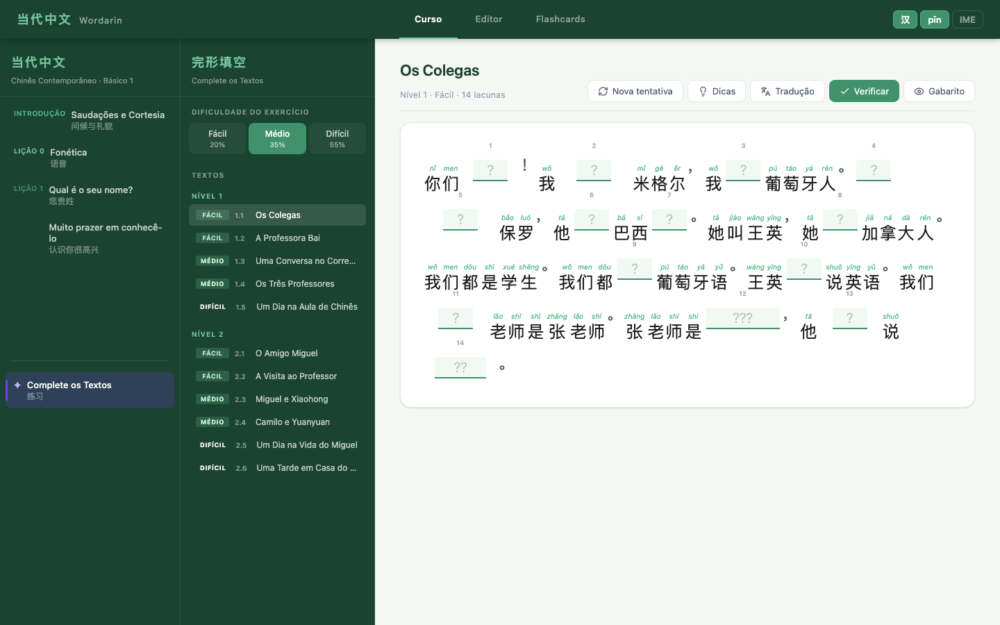
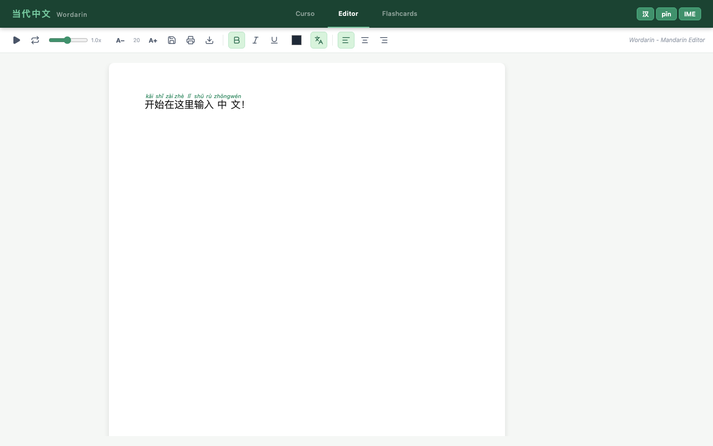
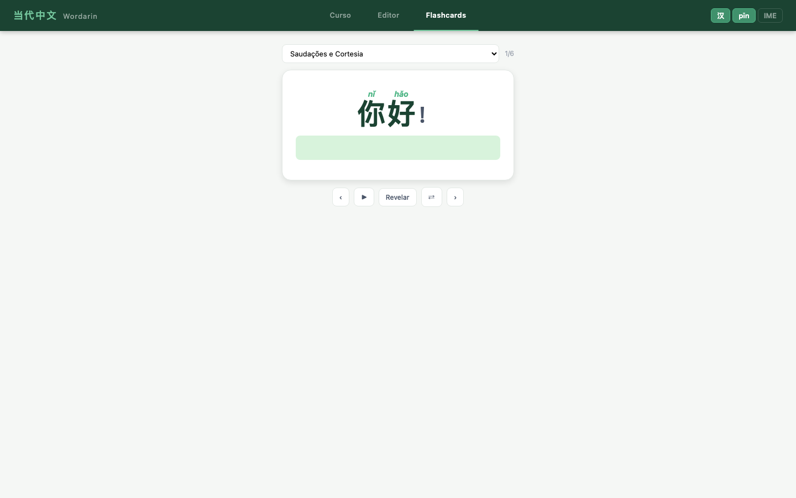

# Wordarin — Mapeamento do Projecto

> Gerado automaticamente por Playwright em 2026-04-28 20:21
> App: http://localhost:5173

---

## Visão Geral

**当代中文 · Wordarin** é uma plataforma de aprendizagem de Mandarim (Chinês Contemporâneo, Básico 1).
Tecnologias: React 19 · Vite · Slate.js · pinyin-pro · hanzi-writer.

### Navegação principal (tabs)
- **Curso**
- **Editor**
- **Flashcards**

### Controlos globais (header)
- `汉`
- `pīn`
- `IME`

---

## Vista Curso



Vista principal da plataforma. Menu lateral com a lista de lições. Ao clicar numa lição carrega o conteúdo na área principal.

### Itens
- INTRODUÇÃO
Saudações e Cortesia
问候与礼貌
- LIÇÃO 0
Fonética
语音
- LIÇÃO 1
Qual é o seu nome?
您贵姓
- LIÇÃO 2
Muito prazer em conhecê-lo
认识你很高兴
- ✦
Complete os Textos
练习

### Sub-secções de lição
- Listening
- Expressões
- Vocabulário
- Exercícios

> Lição intro screenshot: ./screens/02-lesson-intro.png

---

## Complete os Textos (完形填空)



Exercício de preenchimento de lacunas. Sidebar com textos organizados por nível e dificuldade. Área principal mostra o texto com lacunas interativas.

### Itens
- Fácil
20%
- Médio
35%
- Difícil
55%


> Textos disponíveis: FÁCIL
1.1
Os Colegas, FÁCIL
1.2
A Professora Bai, MÉDIO
1.3
Uma Conversa no Corredor, MÉDIO
1.4
Os Três Professores, DIFÍCIL
1.5
Um Dia na Aula de Chinês, FÁCIL
2.1
O Amigo Miguel…

---

## Editor de Texto Chinês



Editor rich-text baseado em Slate.js. Escreve em Mandarim com pinyin automático acima de cada hanzi. Painel de tradução automática ao lado.

### Itens
- A−
- A+


---

## Flashcards



Sistema de flashcards. Cartão com hanzi (e pinyin sobre cada caractere), face oculta com tradução. Controlos de navegação, áudio e modo aleatório.

### Itens
- Saudações e Cortesia
- Sala de Aula
- Termos Gramaticais
- Fonética - Tons
- Lição 1 - Vocabulário
- Lição 1 - Nomes Próprios
- Lição 1 - Gramática
- Lição 1 - Tom de 不
- Lição 1 - Línguas e Países
- Lição 1 - Nomes Chineses
- Lição 2 - Vocabulário
- Lição 2 - Nomes Próprios
- Lição 2 - Gramática
- Lição 2 - Referência
- Fonética - Iniciais


> Contador actual: 1/6


---

## Estrutura de ficheiros

```
src/
├── App.jsx           # Root: routing entre views, estado global do editor
├── Editor.jsx        # Slate rich-text editor com pinyin inline
├── Toolbar.jsx       # Barra de ferramentas do editor
├── CourseView.jsx    # Vista de lição: vocab, diálogos, gramática, exercícios, traços
├── LessonNav.jsx     # Sidebar de navegação de lições
├── Flashcards.jsx    # Sistema de flashcards
├── FillBlanks.jsx    # Exercício de preenchimento (完形填空)
├── AudioPlayer.jsx   # Player de áudio com controlos
├── StrokeOrder.jsx   # Animação de ordem dos traços (hanzi-writer)
├── IMEProvider.jsx   # IME: input de pinyin → hanzi
└── ChineseKeyboard.jsx # Teclado chinês on-screen

public/
├── course-data.json  # Lições, vocabulário, gramática, exercícios
├── flashcards.json   # Decks de flashcards
├── study_texts.json  # Textos para preenchimento de lacunas
└── audio/            # Ficheiros de áudio das lições
```

---

## Componentes internos de CourseView

| Componente | Função |
|---|---|
| `HanziRuby` | Renderiza hanzi com pinyin acima de cada caractere |
| `VocabCard` | Cartão de vocabulário com hanzi/pinyin/tradução e botão de áudio |
| `VocabWhiteboard` | Painel inline de prática de traços para item de vocab |
| `DialogueList` | Lista de expressões/saudações clicáveis com TTS |
| `TextScene` | Diálogo com personagens e tradução |
| `GrammarSection` | Regras gramaticais com exemplos afirmativo/negativo |
| `ExFill` | Exercício fill-in-the-blank |
| `ExTranslate` | Exercício de tradução com resposta ocultável |
| `ExTransform` | Exercício de transformação de frases |
| `ExMatch` | Exercício de correspondência (colunas) |
| `ExToneIdentify` | Exercício de identificação de tons |
| `PhoneticsSection` | Tabela de iniciais/finais/tons com tabs |
| `CharactersSection` | Grelha de caracteres com traços e pronúncia |
| `StrokePanel` | Painel lateral de prática de traços |
